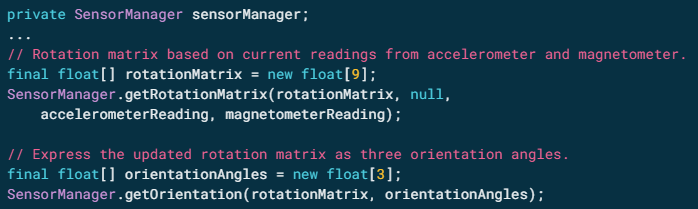

# DANP-ORIENTACION
LABORATORIO ORIENTACION

Se calcula la orientación según el acelerómetro y el magnetómetro.

fuentes para crear la app

Calcular la orientación
https://developer.android.com/guide/topics/sensors/sensors_position

emulador de rotacion
https://developer.android.com/guide/topics/sensors/sensors_overview

orientación de acelerometro
http://josejuansanchez.org/android-sensors-overview/accelerometer/README.html

Cómo usar acelerómetro pildoras informáticas
https://www.youtube.com/watch?v=kDFECsorfqE

